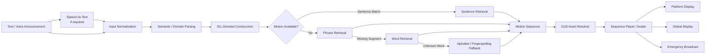
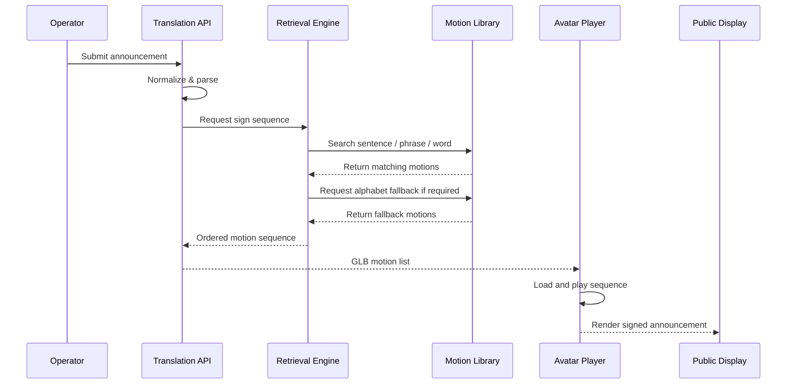

<div align="center">

# 🤟 Signora AI

### Retrieval-Based Text-to-Indian-Sign-Language Translation for Real-Time Public Announcements

**Fast • Deterministic • Retrieval-First • Public-Space Ready**

[](#)
[](#)
[](#)
[](#)
[](#)

**Signora AI** is a retrieval-based intelligent system that converts public announcements into sequenced **Indian Sign Language (ISL) avatar animations**.  
Instead of generating motion from scratch, the system retrieves pre-built sign motions from a structured motion library, making it suitable for **time-sensitive environments such as railway stations, metro stations, airports, hospitals, and other public facilities**.

</div>

---

## ✨ Why Signora AI?

Public announcements are primarily audio-first. This creates an accessibility gap for Deaf and hard-of-hearing users when critical information such as train arrival, platform change, delay, emergency instructions, or route updates is communicated only through speech.

Signora AI addresses this problem using a **retrieval-first translation pipeline**.

Rather than generating a new 3D motion every time an announcement is received, Signora AI:

1. accepts text or voice input;
2. normalizes and interprets the announcement;
3. maps the message to available ISL motion concepts;
4. retrieves the corresponding GLB animation clips;
5. falls back hierarchically when a complete motion is unavailable;
6. sequences the retrieved clips;
7. plays the final sign sequence through a 3D avatar;
8. routes announcements to one or multiple public displays.

This architecture is designed for **low-latency, repeatable, controllable public communication**.

---

# 🎯 Project Objective

The core objective of Signora AI is to build a practical accessibility layer for public-announcement infrastructure by translating structured public messages into understandable sign-language animations.

The system is particularly designed for constrained, high-frequency announcement domains where vocabulary and sentence patterns are more predictable than unrestricted conversational language.

### Primary target domains

- 🚆 Railway stations
- 🚇 Metro stations
- ✈️ Airports
- 🏥 Hospitals
- 🏛️ Government/public-service spaces
- 🏫 Educational campuses
- 🚨 Emergency information displays

---

# 🚀 Core Features

| Feature | Description |
|---|---|
| **Text-to-Sign Translation** | Converts public announcement text into a sequence of retrieved ISL motions. |
| **Voice Input** | Supports spoken announcements through speech-to-text before retrieval. |
| **Retrieval-First Pipeline** | Uses existing validated motion assets instead of generating new motion at runtime. |
| **Hierarchical Retrieval** | Attempts sentence → phrase → word → alphabet-level retrieval. |
| **Fingerspelling Fallback** | Unknown words can be decomposed into alphabet motions when sign motions are unavailable. |
| **GLB Motion Library** | Uses optimized 3D GLB animation files for avatar playback. |
| **Motion Sequencing** | Combines multiple retrieved sign clips into a continuous announcement sequence. |
| **Avatar Playback** | Displays retrieved signs through a 3D avatar in the frontend. |
| **Multi-Display Control** | Allows operators to send global or platform-specific announcements. |
| **Emergency Broadcast Mode** | Supports urgent messages that can be pushed to all configured displays. |
| **Library Management** | Supports concept metadata, GLB association, version control, activation, archival, and rollback workflows. |
| **Research Evaluation Support** | Designed to measure retrieval accuracy, fallback behavior, latency, coverage, and user comprehension. |

---

# 🧠 Retrieval Philosophy

Signora AI intentionally prioritizes **retrieval over generative motion synthesis**.

In public announcement systems, the message must often be displayed immediately. Generating motion dynamically may introduce additional inference delay, produce inconsistent output, or require heavy computation.

A retrieval-based system offers several practical advantages:

- predictable runtime;
- deterministic motion selection;
- reusable validated sign assets;
- low compute requirements;
- easier quality control;
- easier auditing;
- simpler deployment in public infrastructure;
- better suitability for repeated domain-specific announcements.

> **Observed project result:** during internal testing, the system has retrieved and prepared sequences of roughly **12–13 motion clips in about 4 seconds** in the current development environment.  
> This is a project observation, not a universal benchmark guarantee; performance depends on hardware, storage, networking, asset size, and implementation.

---

# 🏗️ High-Level Architecture



---

# 🔄 Retrieval Hierarchy

Signora AI uses a hierarchical lookup strategy:

```text
Sentence
   ↓
Phrase
   ↓
Word
   ↓
Alphabet / Fingerspelling
```

### Example

Input:

```text
Train 1201 arrives at platform 2
```

Possible retrieval behavior:

```text
TRAIN
1201
ARRIVE
PLATFORM
2
```

If a concept such as a station name is unavailable:

```text
NAGPUR
```

may fall back to:

```text
N → A → G → P → U → R
```

This prevents the entire announcement from failing because of one missing vocabulary item.

---

# 🧩 System Workflow



---

# 🗂️ Motion Library Design

The Library acts as the authoritative repository of sign concepts.

A concept may represent:

```text
TRAIN
ACCIDENT
ARRIVE
PLATFORM
DELAY
EMERGENCY
1_ONE
A
B
C
...
```

Each concept can contain:

- canonical concept name;
- aliases;
- search keywords;
- domain/category;
- metadata;
- associated GLB motion;
- version history;
- active/inactive status;
- archived versions;
- motion source information;
- timestamps;
- validation information.

### Recommended concept model

```json
{
  "concept": "TRAIN",
  "aliases": ["train", "railway"],
  "domain": "railway",
  "motion_file": "train.glb",
  "version": 3,
  "active": true,
  "validated": true
}
```

---

# 🎛️ Multi-Display Announcement Control

Signora AI is designed to support both **localized** and **global** announcement routing.

### Platform-specific scenario

```text
Platform 1 → Train delayed
Platform 2 → Train arriving
Platform 3 → Boarding started
```

Each display can show a different sign-language announcement.

### Global scenario

Messages such as:

```text
Emergency evacuation
Accident alert
Exit through emergency gate
Security announcement
```

can be broadcast to **all connected displays simultaneously**.

This makes the system suitable for a centralized railway or metro control room.

---

# 🧪 Example Test Inputs

### Railway

```text
Train 1201 arrives at platform 2
Train 12810 is delayed by 20 minutes
Train 12290 departs from platform 4
The train has been cancelled
Platform changed from 3 to 5
Please stand behind the yellow line
```

### Metro

```text
The next train is arriving
Doors will open on the left
Please mind the gap
This train terminates at the next station
Please change here for the blue line
```

### Emergency

```text
Emergency evacuation required
Please use the nearest exit
Do not use the elevator
Medical assistance is required
Security alert at platform 2
```

---

# 📊 Evaluation Framework

Signora AI can be evaluated from both **system-performance** and **human-understanding** perspectives.

## 1. Retrieval Accuracy

Measures whether the correct sign concept is retrieved.

\[
Retrieval\ Accuracy = \frac{Correct\ Retrievals}{Total\ Retrieval\ Requests} \times 100
\]

---

## 2. Motion Coverage

Measures how much of the test vocabulary is available directly in the library.

\[
Coverage = \frac{Directly\ Available\ Concepts}{Total\ Required\ Concepts} \times 100
\]

---

## 3. Fallback Rate

Measures how frequently fallback logic is required.

```text
Sentence Match Rate
Phrase Match Rate
Word Match Rate
Alphabet Fallback Rate
Unsupported Rate
```

A strong domain-specific library should progressively reduce unnecessary alphabet fallback.

---

## 4. Retrieval Latency

Measure:

```text
Input received
→ translation completed
→ motion list resolved
→ playback started
```

Recommended metrics:

- mean latency;
- median latency;
- p95 latency;
- p99 latency;
- motions retrieved per second;
- playback startup delay.

---

## 5. Sequence Completion Rate

Measures whether all required motions load and play successfully.

\[
Completion\ Rate = \frac{Successfully\ Played\ Sequences}{Total\ Test\ Sequences} \times 100
\]

---

## 6. User Comprehension Evaluation

The strongest validation involves actual ISL users.

Suggested protocol:

1. Show the avatar animation **without showing the source sentence**.
2. Ask the participant what they understood.
3. Compare their interpretation with the intended announcement.
4. Collect ratings for:
   - correctness;
   - comprehensibility;
   - naturalness;
   - motion smoothness;
   - signing speed;
   - fingerspelling clarity;
   - overall usefulness.

---

# 📈 Recommended Research Metrics

| Category | Metric |
|---|---|
| Retrieval | Top-1 Retrieval Accuracy |
| Retrieval | Concept Match Accuracy |
| Coverage | Direct Motion Coverage |
| Fallback | Word Fallback Rate |
| Fallback | Fingerspelling Rate |
| Performance | End-to-End Latency |
| Performance | Retrieval Time |
| Performance | Playback Startup Time |
| Reliability | Sequence Completion Rate |
| User Study | Message Comprehension Rate |
| User Study | Naturalness Score |
| User Study | Smoothness Score |
| User Study | Fingerspelling Clarity |
| Usability | Overall User Satisfaction |

---

# 🧬 Why Public Announcements Are a Strong Initial Domain

General-purpose text-to-sign translation is difficult because unrestricted language contains:

- very large vocabulary;
- complex grammar;
- ambiguous semantics;
- domain switching;
- uncommon names;
- open-ended sentence structures.

Public announcements are more constrained.

Railways, metros, and airports repeatedly use concepts such as:

```text
ARRIVE
DEPART
DELAY
CANCEL
PLATFORM
TRAIN
GATE
BOARDING
EXIT
EMERGENCY
TIME
DESTINATION
SOURCE
```

This allows Signora AI to build a **high-coverage domain vocabulary** before expanding toward unrestricted translation.

---

# ⚙️ Technology Stack

> Update this section to match the final repository implementation.

| Layer | Technology |
|---|---|
| Frontend | React / Web-based UI |
| 3D Rendering | Three.js / WebGL |
| Motion Format | GLB |
| Motion Processing | Blender |
| Backend | Python-based API |
| Retrieval | Structured metadata + indexed motion lookup |
| Speech Input | Speech-to-Text pipeline |
| Data | Motion metadata + GLB asset library |
| Evaluation | Python-based measurement pipeline |

---

# 📁 Suggested Repository Structure

The exact repository may differ. A production-oriented structure can follow:

```text
signora-ai/
│
├── frontend/
│   ├── src/
│   ├── components/
│   ├── pages/
│   └── avatar/
│
├── backend/
│   ├── api/
│   ├── retrieval/
│   ├── translation/
│   ├── library/
│   └── services/
│
├── motion_library/
│   ├── metadata/
│   ├── glb/
│   └── alphabet/
│
├── evaluation/
│   ├── tests/
│   ├── results/
│   └── visualizations/
│
├── research/
│   ├── papers/
│   ├── synopsis/
│   └── reports/
│
├── scripts/
│   ├── conversion/
│   ├── validation/
│   └── indexing/
│
├── docs/
├── README.md
└── LICENSE
```

---

# 🛠️ Installation

Because the final repository structure and commands may vary, use the actual project commands here rather than copying placeholders blindly.

### 1. Clone the repository

```bash
git clone <YOUR_REPOSITORY_URL>
cd <YOUR_PROJECT_DIRECTORY>
```

### 2. Backend setup

```bash
# Example only — replace with the repository's actual backend commands.
python -m venv .venv
```

Activate the environment and install the project's real dependency file.

```bash
pip install -r <REQUIREMENTS_FILE>
```

### 3. Frontend setup

```bash
cd <FRONTEND_DIRECTORY>
npm install
```

### 4. Configure environment

Create the environment configuration required by the repository.

```text
.env
```

Document every required variable in a future `.env.example`.

### 5. Run the application

Use the actual frontend and backend start commands from the repository.

---

# 🧪 Suggested Test Cases

A robust test suite should include:

### Exact motion match

```text
Train
Accident
Platform
Arrive
```

### Multi-token sequence

```text
Train accident
Train arrives
Platform 2
Train 1201 arrives at platform 2
```

### Unknown word

```text
XYZStation
```

Expected behavior:

```text
X → Y → Z → S → T → A → T → I → O → N
```

### Mixed known + unknown concepts

```text
Train arrives at Shravan Nagar
```

Expected behavior:

```text
TRAIN
ARRIVE
...
S H R A V A N
N A G A R
```

### Repeated playback

Run multiple announcements consecutively and verify:

- previous animation state is cleared;
- clips do not overlap incorrectly;
- the avatar remains stable;
- textures are not repeatedly duplicated;
- memory usage remains controlled.

---

# 🔬 Research Contribution

Signora AI investigates the use of **retrieval-based 3D sign-motion translation for latency-sensitive public communication**.

The research direction emphasizes:

- domain-constrained sign retrieval;
- hierarchical motion fallback;
- reusable 3D sign assets;
- deterministic public-announcement translation;
- fast sequence construction;
- motion-library scalability;
- multi-display accessibility;
- user-centered ISL validation.

The system is not positioned as a replacement for qualified interpreters. Instead, it explores how structured public information can be made more accessible when live interpretation is unavailable.

---

# 📚 Dataset & Motion Assets

The project works with a large motion corpus containing converted 3D motion data.

Current development has involved:

- BVH motion processing;
- Blender-based conversion;
- GLB motion export;
- structured concept naming;
- metadata association;
- large-scale motion lookup;
- sign-sequence playback.

Any dataset or motion asset used in a public release should include its corresponding:

- license;
- source;
- attribution;
- redistribution permission;
- ethical-use restrictions.

---

# 🔐 Reliability & Safety Considerations

For public deployment, Signora AI should implement:

- operator authentication;
- announcement approval controls;
- emergency override permissions;
- logging and audit history;
- motion-version validation;
- display health monitoring;
- playback failure detection;
- offline/local fallback;
- rollback to validated motion versions;
- testing with ISL users.

Critical announcements should never rely on a single accessibility channel.

---

# 🗺️ Roadmap

### Phase 1 — Retrieval Core
- [x] BVH motion processing
- [x] GLB conversion pipeline
- [x] motion retrieval architecture
- [x] avatar sequence playback
- [x] alphabet fallback concept
- [x] railway/public-announcement focus

### Phase 2 — Library Intelligence
- [ ] larger validated railway vocabulary
- [ ] phrase-level motion coverage
- [ ] version-controlled motion assets
- [ ] advanced alias handling
- [ ] automatic metadata validation

### Phase 3 — Operational Deployment
- [ ] multi-platform display control
- [ ] global emergency broadcast
- [ ] operator dashboard
- [ ] display health monitoring
- [ ] offline station deployment mode

### Phase 4 — Research Validation
- [ ] ISL expert review
- [ ] Deaf-user comprehension study
- [ ] latency benchmark suite
- [ ] large-scale retrieval evaluation
- [ ] ablation study of fallback strategies

### Phase 5 — Expansion
- [ ] metro vocabulary
- [ ] airport announcements
- [ ] hospital announcements
- [ ] multilingual announcement input
- [ ] broader public-service deployment

---

# 💡 Example Operational Scenario

A control-room operator enters:

```text
Train 1201 is delayed by 20 minutes and will arrive at platform 2.
```

Signora AI:

```text
1. normalizes the sentence;
2. identifies railway-domain concepts;
3. resolves known signs;
4. applies fallback to unsupported tokens when required;
5. retrieves the corresponding GLB motions;
6. constructs the ordered animation sequence;
7. loads the sequence into the avatar;
8. displays the signed announcement on the selected platform screen.
```

At the same time, an emergency message can be broadcast to every display:

```text
Please evacuate the station using the nearest emergency exit.
```

---

# 🧾 Research Citation

If you use Signora AI in academic work, add the final publication details here.

```bibtex
@misc{signoraai2026,
  title        = {Signora AI: Retrieval-Based Text-to-Indian-Sign-Language Translation for Public Announcements},
  author       = {Project Team},
  year         = {2026},
  note         = {Final-year research project}
}
```

---

# 🤝 Contributing

Contributions can focus on:

- ISL linguistic validation;
- motion-library expansion;
- retrieval algorithms;
- 3D animation optimization;
- accessibility research;
- UI/UX;
- public-display integration;
- evaluation tooling.

Before contributing sign motions, verify that the motion source and license permit reuse.

---

# 📜 License

Add the final project license here.

```text
LICENSE: To be decided
```

If the repository contains third-party datasets, avatars, or motion files, their licenses may differ from the source-code license.

---

# 🙌 Acknowledgements

This project is built around the goal of improving accessibility in public communication.

Special acknowledgement should be given to:

- Deaf and hard-of-hearing users who participate in validation;
- Indian Sign Language experts;
- dataset creators;
- open-source 3D and accessibility communities;
- academic mentors and project reviewers.

---

<div align="center">

## 🤟 Signora AI

### Making public information visible, not only audible.

**Retrieval-Based • Accessible • Real-Time • Public-Space Focused**

</div>
