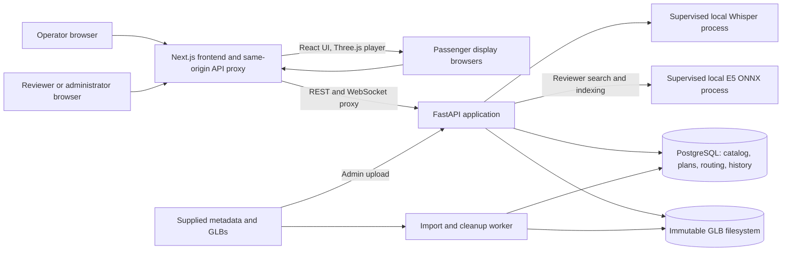
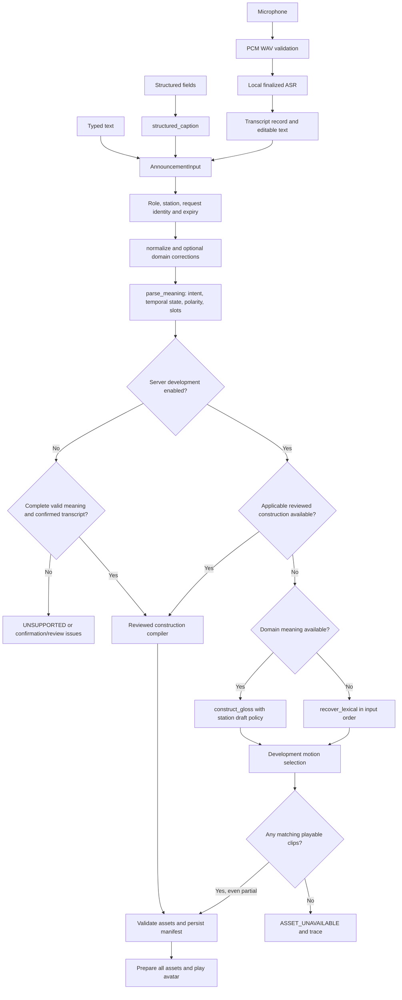
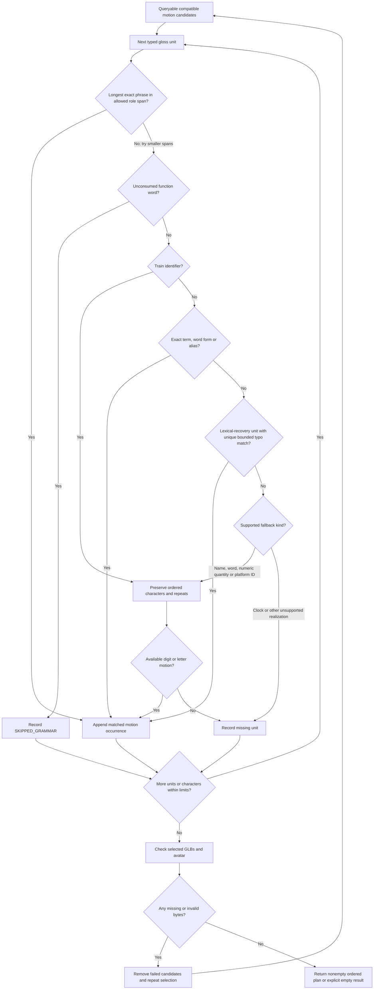
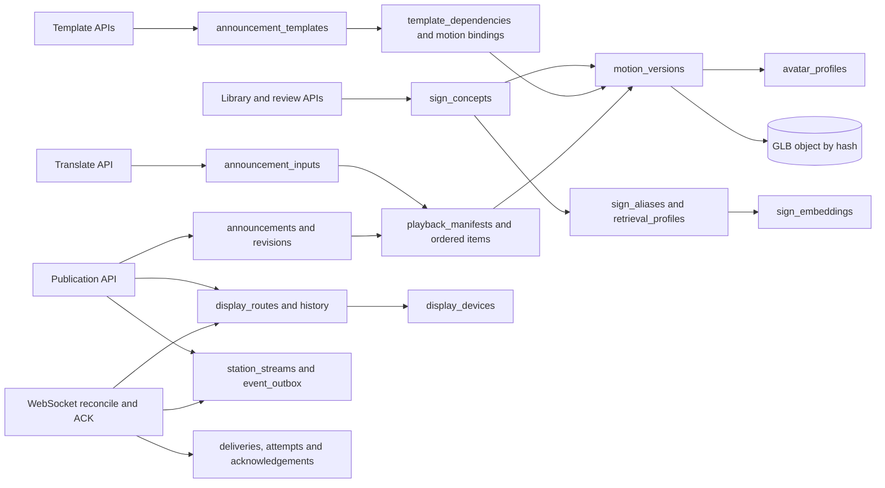
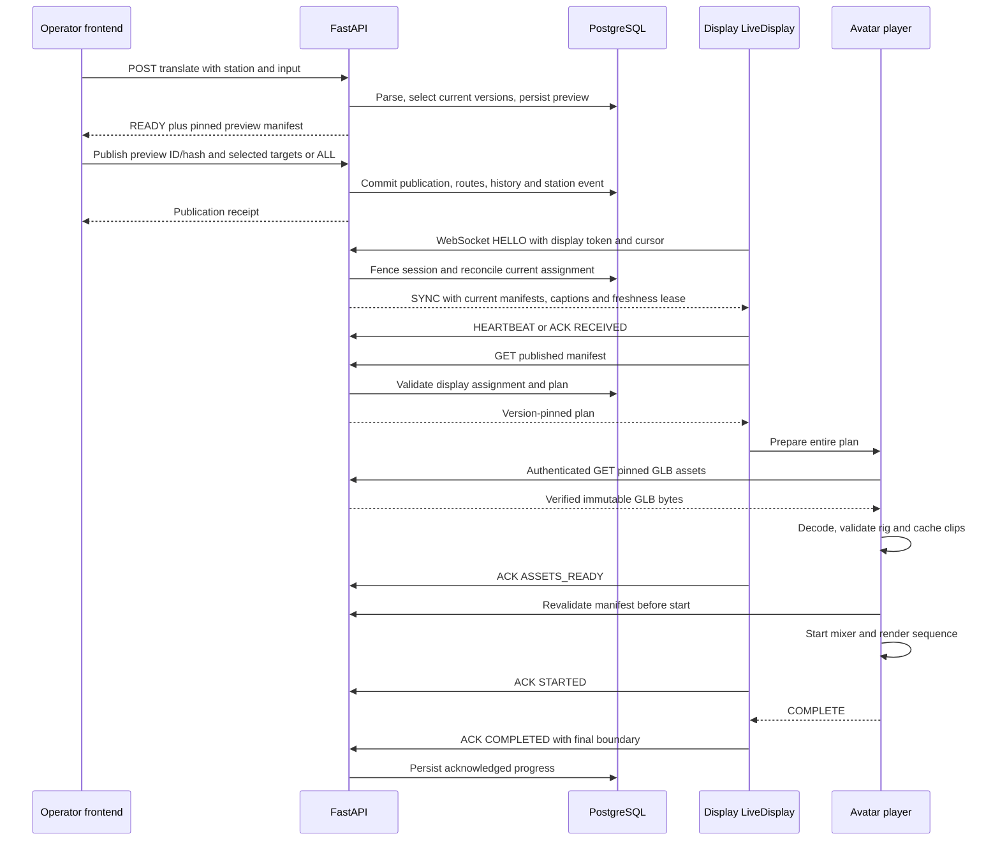

# Signora: implemented architecture and end-to-end workflow

This document describes the repository as inspected on **28 September 2026**, including its current development preview and multi-display implementation. It describes code behavior, not an intended future design. Runtime source, schemas and migrations take precedence over older milestone descriptions in the README or implementation plan.

**Signora retrieves existing ISL motion assets and plays their animation clips on a persistent Three.js avatar. It does not generate a new sign, synthesize an animation with an LLM, or create a sentence GLB.** The backend returns an ordered, version-pinned playback manifest; the browser loads the referenced GLBs and executes their clips.

The most important architectural distinction is between three paths:

| Path | Actual implementation | Result |
|---|---|---|
| Reviewed announcement compilation | `announcements._compile()` and `templates.py` | A complete construction bound to reviewed concepts, versions, meaning and station configuration. Missing or ambiguous coverage blocks signing. |
| Development announcement retrieval | `announcements.translate()` → `gloss.py` → `demo.prepare_demo()` | Available compatible motions, including unreviewed staged content and partial lexical/fingerspelling output. A reviewed construction is tried first when applicable. |
| Reviewed candidate search | `retrieval.search.search()` | Exact/alias/trigram/embedding suggestions. This is a separate reviewer API, not the algorithm automatically called for every development preview. |

`SIGNORA_DEMO_MODE_ENABLED` controls the server's development behavior. Its code default is `false`; the evaluated local configuration enabled it. The current frontend has no demo checkbox. The obsolete-looking `demo_mode` request field remains accepted by the schema, but the server setting determines `translate()` behavior. Setting that request field to false does not force strict compilation on a development-enabled server.

## Contents

1. [Processes and system boundaries](#1-processes-and-system-boundaries)
2. [Repository and module map](#2-repository-and-module-map)
3. [Pages, identities and roles](#3-pages-identities-and-roles)
4. [Input and voice processing](#4-input-and-voice-processing)
5. [Normalization, meaning and gloss](#5-normalization-meaning-and-gloss)
6. [Retrieval and version selection](#6-retrieval-and-version-selection)
7. [Templates and coverage](#7-templates-and-coverage)
8. [Database and transaction model](#8-database-and-transaction-model)
9. [Library, ingestion and version lifecycle](#9-library-ingestion-and-version-lifecycle)
10. [Manifest and GLB delivery](#10-manifest-and-glb-delivery)
11. [Persistent avatar and playback](#11-persistent-avatar-and-playback)
12. [Publication and multi-display delivery](#12-publication-and-multi-display-delivery)
13. [Complete worked announcement trace](#13-complete-worked-announcement-trace)
14. [API inventory and frontend callers](#14-api-inventory-and-frontend-callers)
15. [Caching and performance boundaries](#15-caching-and-performance-boundaries)
16. [Validation, errors and recovery](#16-validation-errors-and-recovery)
17. [Security and observability](#17-security-and-observability)
18. [Running, deployment and backups](#18-running-deployment-and-backups)
19. [Tests and measured evaluation](#19-tests-and-measured-evaluation)
20. [Incomplete, legacy and planned behavior](#20-incomplete-legacy-and-planned-behavior)
21. [Developer navigation and change impact](#21-developer-navigation-and-change-impact)

## 1. Processes and system boundaries

The architecture is a modular Python backend, a separate Next.js frontend, PostgreSQL, an immutable local asset store and a separate registry worker. Each passenger display runs its own browser/player. There is no broker, Redis, separate vector database, animation-generation service or microservice fleet.



The diagram's arrows denote communication/dependencies, not separate deployments for every module.

| Runtime | Concrete entry point and responsibility |
|---|---|
| Next.js | `frontend/src/app/`, `frontend/next.config.mjs`; React pages, same-origin `/api/:path*` rewrite, microphone capture and Three.js rendering. |
| FastAPI | [`backend/app/main.py`](backend/app/main.py), `create_app()`; composes routers, authentication, body limits, database pool, asset store and model supervisors. Uvicorn uses the application factory. |
| PostgreSQL | SQLAlchemy 2 + psycopg; ORM for catalog/input records and explicit parameterized SQL for several delivery/search workflows. `pg_trgm` and `vector` extensions. |
| Registry worker | [`backend/app/worker.py`](backend/app/worker.py), `main()`; durable imports and physical asset cleanup. Separate process, one or two import workers, two-second idle polling. |
| ASR process | `asr.LocalASR` supervises `asr_worker.serve`; local CPU `faster-whisper`, independently timed out/terminated. |
| Encoder process | `retrieval.encoder.LocalEncoder` supervises ONNX inference for reviewer search/indexing. It does not produce signs or motion. |
| GLB store | `storage.LocalAssetStore`; content-addressed files outside PostgreSQL. |

Pinned frontend package versions are Next.js 16.3.5, React/React DOM 19.3.0, Three.js 0.186.0 and Playwright 1.63.0. Node requires at least 20.19. Python support is `>=3.12,<3.14`; backend dependency ranges and resolved versions live in `backend/pyproject.toml` and `backend/uv.lock`. The runtime is not React Three Fiber: it uses Three.js directly.

`main.create_app()` warms ASR and encoder asynchronously during lifespan startup and closes them and the database engine on shutdown. Readiness verifies schema `0009_display_routing`, the eligibility view and storage-directory existence. It does **not** prove all content is approved, every asset is readable, models are ready, or a station is operationally covered.

## 2. Repository and module map

```text
backend/
  app/                  FastAPI and business logic
    assets/             Metadata, GLB and Khronos validation; inventory CLI
    retrieval/          Review search, encoder, profiles, playback contracts
  alembic/versions/     Authoritative database migrations 0001 through 0009
  tests/                Unit, database integration and opt-in browser/model tests
  tools/                Windows local launcher and Node GLB validator
  artifacts/            Local tools, models, generated test/runtime artifacts
  pyproject.toml        Backend package/dependencies and CLI entry points
  uv.lock               Resolved Python dependency lock
frontend/
  src/app/              Next.js route shells, layout, CSS and error boundary
  src/components/       Operator, review, management and display workspaces
  src/services/         REST, voice capture, live protocol, setup/example helpers
  src/motion/           GLB fetch/cache, rig validation and sequence controller
  public/               Includes pcm-recorder-worklet.js
  scripts/              Real-browser verification harnesses
  tests/                Node tests for service and playback boundaries
  next.config.mjs       Backend rewrite and HTTP headers
metadata_json and glb/
  metadata/             Supplied source metadata
  glb/                  Supplied source motion files
research_results/       Audit, reproducible measurement scripts, evidence and charts
tests/research_evaluation/  Authored evaluation datasets and evidence checks
isl-retrieval-production/   Development skill and reference contracts
README.md, SETUP.md      Existing overview and setup guidance
requirements.txt        Convenience dependency list; pyproject/lock are canonical
```

`.venv`, `node_modules`, `.next`, caches and generated artifacts are environments/output, not additional application architectures. Root `powershell.cmd` is a Windows PowerShell forwarding shim. Source assets are ingestion inputs; the browser does not serve arbitrary files from the source folder. The MP4-to-GLB converter is outside this application's workflow.

### Backend responsibilities

| Files | Responsibilities / principal functions |
|---|---|
| `main.py`, `config.py`, `database.py`, `http_limits.py` | App factory; configured principals/model/storage settings; bounded database pool; authenticate and cap requests. |
| `models.py` | Catalog, library, review, import, cleanup, preview, station and template ORM records. Not a complete listing of live tables: migrations and `live.py` SQL matter too. |
| `announcement_api.py`, `announcement_schema.py` | Input/capability, station and template HTTP contracts; typed meaning, station definitions, recipes and result schemas. |
| `announcements.py` | `translate`, `_compile`, `write_station`, `validate_announcement_context`, receipt replay and station authorization. |
| `meaning.py`, `lexical.py`, `gloss.py` | Full-clause meaning parsing, bounded spelling normalization, typed domain gloss and lexical recovery. |
| `demo.py` | Candidate catalog query, compatible avatar grouping, typed-unit phrase/word/digit/letter matching and partial selection trace. |
| `audio.py`, `asr.py`, `asr_worker.py`, `asr_model.py` | Audio validation, supervised inference, finalized transcript diagnostics and explicit pinned-model provisioning. |
| `templates.py` | Recipe creation, dependency resolution, exact preview/review evidence, activation and ordered expansion. |
| `registry.py`, `catalog.py` | `stage_motion`; shared/exclusive catalog advisory lock and central eligibility helper. |
| `library.py`, `lifecycle.py`, `lifecycle_schema.py`, `lifecycle_api.py` | Development/production selection, content review, metadata revisions, archive/restore/revoke/delete and cleanup. |
| `imports.py`, `worker.py` | Discovery, idempotent import jobs, leased claims/heartbeats/retries, worker orchestration. |
| `storage.py` | Safe keys, bounded staging, durable content-addressed storage, checksum verification and deletion. |
| `assets/metadata.py`, `assets/glb.py`, `assets/khronos.py`, `assets/inventory.py` | Source schema projection, byte/animation/rig inspection, official validator subprocess and read-only inventory reports. |
| `playback.py`, `playback_api.py`, `retrieval/playback_schema.py` | Persist/validate active playback contracts, owner/display access and authenticated immutable GLB delivery. |
| `retrieval/catalog.py`, `search.py`, `search_schema.py`, `search_policy.py`, `api.py` | Reviewed profiles/aliases, revision-bound embeddings and scoped review-only candidate retrieval. |
| `retrieval/encoder.py`, `encoder_model.py` | Local E5 supervision, pooling/normalization, bounded query cache and model integrity. |
| `live.py`, `live_schema.py`, `live_api.py` | Publish/revise/withdraw, station stream, display registration/session, SYNC and ACK protocol. |
| `display_control.py` | Per-display targeting, route revisions/history, stop and platform assignment. |
| `workspace_api.py` | Read models for library, template impact, imports, station announcements and display dashboards. |
| `recovery.py` | Offline CLI for consistent PostgreSQL + GLB backup, verification and fenced restore. |
| `retrieval/manifest.py`, `retrieval/__init__.py` | Earlier pure schema-1 manifest compiler/export. Retained and unit-tested, but not the active HTTP player contract. |

### Frontend responsibilities

| Component/service | Responsibility |
|---|---|
| `ReviewConsole.jsx` | Browse exact motion versions; construct/reorder/repeat private review sequences; exact-text and prepared-review-plan tabs. |
| `AnnouncementConsole.jsx` | Connect, obtain stations/capabilities, text/structured/voice input, translation diagnostics, prepare/play preview and development dispatch. |
| `ControlRoom.jsx` | Poll display status, select targets, broadcast, emergency priority, stop, platform labels and assignment history. |
| `PublicationPanel.jsx` | Reviewed publication confirmation, revisions, withdrawal, same-request retry and station history. |
| `AdminConsole.jsx` | Role-aware management tabs and session connection. |
| `LibraryManager.jsx` | Search concepts; inspect versions, reviews and impact; upload/update/select/archive/restore/delete; review aliases/profiles and request indexing. |
| `TemplateManager.jsx` | Template definitions, dependencies/coverage, prepared example playback and review/activation. |
| `OperationsManager.jsx` | `ImportManager`, `StationManager`, `DisplayManager`, `AuditManager`. |
| `DisplayConsole.jsx` | Registered display ID/token form, connection/signing status, incoming caption and automatic player. |
| `AvatarViewer.jsx` | Scene, camera, lights, WebGLRenderer, persistent controller instance, sizing and diagnostics. |
| `workspace.jsx` | Navigation, cancellable workspace requests, errors/notices, fields, paging and JSON inspection. |
| `WorkspaceGuidance.jsx`, `Icon.jsx`, `globals.css` | Explanatory/UI presentation; not retrieval or authorization logic. |
| `services/api.mjs` | Bearer REST fetch, abort/timeout/error mapping, manifest revalidation. |
| `services/recorder.mjs`, `public/pcm-recorder-worklet.js` | Bounded microphone PCM capture and WAV assembly. |
| `services/live-display.mjs` | `DisplayProgress`, `selectQueue`, `LiveDisplay`: socket, queue, leases, ACKs and reconnect. |
| `services/station-setup.mjs` | Basic numbered-platform definitions and station-ID suggestion. |
| `services/template-example.mjs` | Builds an arrival example from real supplied concept IDs; refuses absent/ambiguous concepts. Not a source of synthetic library records. |
| `motion/asset-store.mjs` | Verified GLB loading, decoded clip cache, avatar ownership and resource disposal. |
| `motion/rig-validation.mjs` | Structural rig/track compatibility and finite-pose checks. |
| `motion/playback-controller.mjs` | Manifest validation, full-sequence readiness, one mixer, ordered playback, boundary stops and cleanup. |

## 3. Pages, identities and roles

| URL | Page component | Main workflow |
|---|---|---|
| `/` | `ReviewConsole` | Content review with Motion library, Exact text and Prepared review tabs. |
| `/announcements` | `AnnouncementConsole` | Operator input, control room, private avatar and publication/history. |
| `/admin` | `AdminConsole` | Library, Templates & coverage, Imports, Stations, Displays, Audit. Reviewer access exposes content work; admin actions remain server-protected. |
| `/display` | `DisplayConsole` | One registered passenger display connection and automatic incoming signing. |

The route files in `frontend/src/app/` mostly mount these components. `layout.jsx` supplies English HTML, shared CSS and non-indexable page metadata; `error.jsx` handles page-level rendering failures.

Authentication is **configured opaque bearer tokens**, not username/password login, JWT, OAuth or a database users table. `Settings.principals` maps `SHA-256(token)` to a `Principal` containing subject, role set, expiry and station IDs. API authentication uses constant-time digest comparison and expiry checks. Role authorization happens again in the relevant router/service.

| Role | Effective responsibilities |
|---|---|
| `admin` | Station setup, imports, version changes/deletion, template activation, device registration, audit; also reviewer/operator capabilities where explicitly accepted. |
| `reviewer` | Library, avatar/meaning/motion/template review, candidate search/index metadata; can prepare input/private review but cannot operate dispatch solely by being a reviewer. |
| `operator` | Station-scoped text/voice/structured input, exact-content preparation, publication and control room. |
| `display` | Registered subject plus station scope and fresh live session; receive assigned published plans/assets and send acknowledgements. |

`announcements.check_station_scope()` and live/device checks define the scope rules; admin/reviewer input access is broader than a scoped operator's access. A display UUID is a database registration identity, **not** its platform number, station code, token-map key or bearer token. Multiple display identities may belong to one platform; platform count and display count are independent.

Credentials stay in component/session memory and are cleared by disconnect. The live progress store persists only IDs/cursors/completion IDs, not tokens or captions. The application currently has no credential issuance/rotation UI; provisioning credentials and registering display subjects are separate operations.

## 4. Input and voice processing

### Common input envelope

`AnnouncementConsole.body()` creates a fresh request UUID, station ID, input type and English language, plus the relevant data:

```json
{
  "request_id": "<fresh UUID>",
  "station_id": "NAGPUR",
  "input_type": "TEXT",
  "source_text_language": "en",
  "text": "Train 1201 arrives at platform 2"
}
```

This is a shape illustration: replace the UUID and use a configured station. `AnnouncementInput` accepts `TEXT`, `VOICE` or `STRUCTURED`. Text is bounded to 2,048 characters and must be nonblank. Structured input supplies `StructuredMeaning`, not a second text field. Voice requires a server-issued `transcript_id`; other input types cannot attach a transcript confirmation.

`POST /api/v1/translate` delegates to `announcements.translate()`. It checks identity/station, preview validity (at most 15 minutes), acquires a shared catalog lock and a subject/request advisory lock, and checks an existing request receipt. The same request ID/body replays the receipt; different content under that ID produces an idempotency conflict. An expired or now-invalid prior manifest is not blindly reused.

### Voice path

1. `PushToTalkRecorder.start()` asks for microphone permission and creates a 16 kHz `AudioContext` and AudioWorklet. Unsupported sample rate or unavailable secure microphone APIs is an explicit error.
2. The worklet collects mono PCM; output to the audio destination is silence, not microphone monitoring. Capture stops at 60 seconds. Cancellation stops tracks, disconnects nodes and closes the context.
3. `pcmWav()` creates a 16-bit, mono, 16 kHz WAV. The frontend uploads multipart `audio` to `/voice/transcribe`.
4. `audio.inspect_audio()` checks RIFF/WAVE structure, exact length, encoding, duration 0.25–60 seconds, maximum 2 MiB and minimum RMS for silence detection.
5. `LocalASR` calls a supervised process with a timeout. `asr_worker.serve()` uses the pinned local English faster-whisper model, CPU int8, four threads, beam size 5, VAD, deterministic temperature and word timestamps. Model provisioning is explicit; inference does not download models.
6. The backend saves a `voice_transcripts` record with owner, text, audio hash, model/segment diagnostics and 15-minute expiry. The staged raw recording is deleted; it is not a GLB/library asset.
7. The response is `NEEDS_CONFIRMATION` with final text and transcript identity. Low-score words are diagnostics, not calibrated correctness probabilities.
8. The frontend permits transcript correction. Strict translation requires explicit confirmation. In the current development configuration, `stopRecording()` automatically forwards a nonempty final transcript to the common translation path and can automatically play/dispatch it.

Voice is push-to-talk finalized transcription, **not streaming recognition of every station loudspeaker**. English is the exposed input language; a multilingual embedding model does not imply Hindi/Marathi ASR or grammatical support.

## 5. Normalization, meaning and gloss



### Normalization and spelling recovery

`meaning.normalize()` casefolds text, folds whitespace, converts Unicode decimal digits to ASCII digits and keeps original character offsets for slots. `lexical.normalize_domain()` applies explicit canonical forms and conservative whole-word spelling corrections in development parsing. Its vocabulary includes railway terms; examples of canonical mapping are `canceled → cancelled`, `arrival → arrive` and `departure → depart`.

`lexical.fuzzy_word()` accepts a unique one-edit candidate only for alphabetic words at least four characters long, with matching first character and close length. It includes adjacent transpositions. It does not mutate numeric identifiers, short words or an exact known term. This is deterministic spelling recovery, not general grammatical rewriting.

The development catalog has a separate term normalization in `demo._normalized()`: NFKC, casefolding, underscore replacement, decimal normalization and word/number tokenization. Catalog term normalization must not be confused with the original-offset-preserving input normalization.

### Typed semantic parser

`meaning.parse_meaning()` supports five typed intents: arrival, departure, delay, cancellation and platform change. It uses anchored English patterns, not a trained language parser. Meaning includes temporal state, polarity and typed slots. Development patterns accept additional forms such as “arrives”, optional identifiers/platforms, directional relations and time modifiers. Unrecognized compound clauses do not become silently approved meanings.

`_slot()` checks:

- Train identifier length/suffixes against station configuration, retaining digits as identifiers.
- Platform against the station's configured platform inventory.
- Duration quantity and explicit minute/hour units.
- Clock time, explicit service date and ambiguity around 12-hour notation; timezone is currently fixed to `Asia/Kolkata`.
- Place/train-name values against unambiguous configured names/aliases in strict typed resolution.

These are **format and local configuration checks**. They do not consult a live timetable to establish whether a train really arrives, whether a delay is true, or whether a destination is correct. Development can return clips despite semantic issues and records those issues in its trace.

### Gloss construction and lexical recovery

`gloss.construct_gloss()` produces `GlossUnit(token, kind, role)` objects. Default station order is:

```text
entity → source → destination → location → time → polarity → event → duration
```

Train identifiers become `IDENTIFIER` units; platform identifiers, quantities, clocks and names have distinct kinds. FROM/TO, NOT, FUTURE, ALREADY and time modifiers are represented when the parser recognizes them. Default lexical forms include `NOW → NOW RIGHT NOW`. These are configurable **engineering draft rules**, not established ISL linguistic approval.

If the domain parser fails, `recover_lexical()` preserves input order and recovers independent train/platform/clock/duration hints without inventing a complete intent. It classifies `at`, `on`, articles and selected auxiliaries as `FUNCTION`. These tokens participate in phrase matching, but are skipped as `SKIPPED_GRAMMAR` if no phrase consumes them. Meaningful direction/negation terms are not indiscriminately removed as stopwords.

Consequently, the current implementation does not normally fingerspell standalone “at” just because it occurs in English. It also does not guarantee that every unsupported sentence becomes grammatically correct ISL. A lexical sequence can be incomplete or semantically insufficient.

`translation_trace()` records original/normalized input, English tokens, corrections, semantic parse or partial semantics, construction source, typed gloss units and retrieval tokens. `tokens` in the compatibility response now denotes gloss/retrieval tokens, not necessarily the English word order.

## 6. Retrieval and version selection

### 6.1 Development catalog and usable versions

`demo.prepare_demo()` reads PostgreSQL for each new translation. Candidate motions must be ISL, technically passed, nondeleted, nonrevoked, positive duration and `STAGING` or `ACTIVE`. It honors an explicit enabled `library_selections` row; otherwise it uses the compatible legacy active/unselected catalog rules. An explicit disabled selection prevents fallback from resurrecting that concept.

Rows are grouped by avatar profile, largest group first with deterministic tie ordering. Within a group, ordering is semantic key, version number and motion ID; one candidate per concept is chosen. This is **not** “always take the newest GLB” or a transition-quality ranking. Administrators should explicitly select the desired library version.

The avatar source is the retained motion matching the profile's canonical source hash when available; development can use the group's first motion as its source fallback. One returned plan uses one compatible profile. Different skeletons are not mixed or automatically retargeted.

Candidates derive terms from canonical text and gloss. Labels such as `2_TWO` additionally expose `2` and `two`. Semantic IDs such as `ISL_TRAIN_01` are deliberately not tokenized into matching digits. A phrase's individual component words do not automatically identify the whole phrase. Development reads database aliases without requiring their review approval.

### 6.2 Actual phrase/word/number/alphabet hierarchy



Implementation details in `demo._select()`:

1. Longest phrase lookup is allowed across contiguous lexical/function units with the same role. It never merges across identifier/name roles. A full-sentence asset can match as an exact compatible term span, but there is no independent sentence-generation algorithm.
2. Term lookup prefers exact term; for lexical kinds it then tries bounded suffix forms (`arrives → arrive`, selected `-ing/-ed/-ies/-s` variants), stored aliases, and—for `LEXICAL` recovery only—unique bounded fuzzy spelling.
3. `IDENTIFIER` always decomposes characters, preserving zeroes and repeated digits. It does not convert train `1201` into the quantity “one thousand two hundred one”.
4. `NAME` tries longest phrases within the name, then smaller words, then character spelling.
5. A platform identifier or quantity first gets an exact lookup; if supported and missing it decomposes. Digit lookup tries literal character/alias, then English digit name. Unknown lexical words use available alphabet motions.
6. A clock requires a meaningful exact realization; it is not reduced to digits after dropping colon/AM/PM. Other unsupported unit kinds become explicit missing units.
7. Missing pieces are recorded and skipped in development. Sequence length is at most 64 occurrences and 600 seconds. Matching duplicates are retained as occurrences even though decoding is deduplicated later.
8. If selected bytes fail validation, `prepare_demo()` removes those candidates and retries smaller matches/other usable versions or profiles. Only input-related matches count. Current `last_resort` is always false: **the earlier request for unrelated random demonstration motions is not implemented in the current path**.

A partial nonempty sequence can return `READY` with `PARTIAL`, `LEXICAL_ONLY` or missing-gloss diagnostics. `READY` means a plan exists, not that the translation is correct or complete. A genuinely empty sequence returns `ASSET_UNAVAILABLE` / `NO_MEANINGFUL_MOTIONS`.

### 6.3 Strict hierarchy is construction-based

`announcements._compile()` filters enabled approved template versions by exact intent, temporal state, polarity, slot-type set and fixed values. It tries reviewed construction stages in this order:

```text
TEMPLATE → EXACT → PHRASE → WORD
```

Each fallback is a **separately reviewed complete recipe**. It is not the development word-splitting algorithm. Every slot must be realized, dependencies must still match reviewed bindings, and exactly one usable complete recipe must remain. `EXACT` permits a whole literal-bound sentence motion. Digits and restricted name spelling happen only under the recipe's explicit realization policy.

### 6.4 Separate candidate search and metadata indexing

`retrieval.search.search()` is exposed under `/api/v1/review/retrieval`. It joins `eligible_motion_versions` and approved `retrieval_profiles`, scoped by avatar, domain, context, level and optional sense. Reviewed aliases additionally require English source language and matching semantic revision.

Stages are exact canonical text, exact approved alias, PostgreSQL trigram suggestions and optional E5 semantic suggestions. The current policy constants are fuzzy minimum `0.2`, semantic minimum `0.83`, ambiguity margin `0.03`. Stage scores are not probabilities. Candidate SQL is bounded to 12 per query stage; approximate candidates never directly authorize a playback plan.

`compatible_text()` rejects some numeric, train/platform-role, negation, event, temporal, duration-unit and from/to conflicts. It is a candidate comparison guard, not a trusted railway fact checker. Evaluation found destination-only conflicts it misses.

The encoder is pinned `intfloat/multilingual-e5-small`, revision `614241f622f53c4eeff9890bdc4f31cfecc418b3`, with local ONNX CPU inference, query/passage prefixes, masked mean pooling, L2 normalization and 384 dimensions. Input exceeding 512 tokens is rejected rather than silently truncated. Search uses exact pgvector distance; no HNSW/IVFFlat ANN index is created by these migrations.

`retrieval.catalog.passage()` builds an embedding input from canonical text, semantic revision, reviewed description/domain/context/sense and eligible reviewed aliases. Index rows are pinned to semantic revision, model revision, encoding policy and input hash. Indexing is explicit and resumable; a stale embedding is filtered out rather than treated as current. After inference, catalog state is re-read before accepting results. The Library UI can review profiles/aliases and request indexing; no current frontend component calls candidate `/search` as part of announcement preview.

## 7. Templates and coverage

**Library = signs and motion versions. Template = a signing construction. Coverage = whether that construction can realize its meaning using the required current motions and bindings.** They solve different problems.

`TemplateDefinition` contains source language, intent, temporal state, polarity, slot types, fixed values, avatar profile, ordered recipe, retrieval stage, `FULL_CLIP_CUT` transition policy and safe interruption groups.

Recipe steps are:

- `CONCEPT`: a concrete concept UUID plus the meaning elements it covers and its semantic group.
- `SLOT`: a named slot, group and explicit realization policy.

Realization policies are `EXACT_VALUES` (value → explicit concept sequence), `IDENTIFIER_CHARACTERS` (ordered character → sequence, requiring digits), and `ISL_FINGERSPELL` (reviewed configured name spellings and the full Latin alphabet). Generic fingerspelling cannot silently stand in for clock times or arbitrary quantities in the strict path.

The schema checks that every intent/polarity/time/slot meaning element is covered exactly once, groups are contiguous, fixed literal content is not reused for different values, and policy types fit slot types. `templates.selected_dependencies()` resolves active eligible versions and bytes; review binds those exact dependencies. `preview_template()` persists a plan and its definition/meaning/bindings. `review_template()` requires rendered preview evidence tied to the reviewer and exact construction; `activate_template()` is a separate action.

An executable conceptual example is an arrival recipe for a train ID and platform ID. It needs actual TRAIN, platform/context/event/time concepts and numeric realization concepts from the library. `TemplateManager`'s arrival-example helper resolves real IDs instead of inventing UUIDs. An arrival at platform 2 does not prove a template covers “from platform 2”, a cancellation or an emergency evacuation. A new GLB version may be immediately available in development yet require construction re-review before strict publication because its binding changed.

Coverage is calculated from definitions/dependencies/current bindings; there is no independent `coverage` database table. It does not mean every English paraphrase is supported or that a linguistic expert has confirmed comprehension.

## 8. Database and transaction model

The migration chain is authoritative. ORM definitions alone omit several live-delivery and embedding tables.

| Migration | Added responsibility |
|---|---|
| `0001_registry` | Concepts, versions, aliases, profiles, audit/events, pointer integrity, immutable identity and initial eligibility; `pg_trgm`. |
| `0002_playback` | Normalized exact-text lookup and immutable playback manifests/items with reference-completeness checks. |
| `0003_lifecycle_import` | Review evidence, semantic revision binding, deletion state, imports and cleanup jobs. |
| `0004_announcement_input` | Stations, templates/dependencies/bindings/previews, transcripts, input receipts and announcement-manifest references. |
| `0005_progressive_retrieval` | Scoped profiles/aliases, immutable revision/model-bound `vector(384)` embeddings; `vector` extension. |
| `0006_live_delivery` | Publication/revisions, station cursor/outbox, display/session/delivery/ACK records and live invalidation triggers. |
| `0007_library_workflow` | Development library selections and metadata revision history. |
| `0008_library_reupload` | Retained-version checksum uniqueness allowing controlled new versions after deletion. |
| `0009_display_routing` | Display platform labels, targeted revisions, routes, command idempotency and assignment history. |

### Persistent records

| Tables | Meaning and important relationships |
|---|---|
| `avatar_profiles` | Rig fingerprint/version, canonical source SHA-256, review status/revision. Shared by compatible motion versions. |
| `sign_concepts` | Stable UUID and unique semantic key, gloss/canonical text, ISL level/domain/meaning/context, semantic revision, enabled flag and production active pointer. |
| `motion_versions` | Concept/version number, immutable storage key/hash/size/clip/duration/profile, technical report/source metadata, reviews and lifecycle/deletion/revocation state. |
| `sign_aliases` | Concept-bound normalized aliases and review scope/evidence. No independent GLB identity. |
| `library_selections` | Explicit development selection and enabled state, separate from production approval. |
| `motion_metadata_revisions` | Version-bound uploaded JSON corrections, hash, actor, reason and timestamp. |
| `content_reviews` | Immutable decision, entity type/ID, actor, evidence and reason. |
| `retrieval_profiles`, `sign_embeddings` | Reviewed semantic search representation and pinned 384-dimensional vectors. |
| `admin_audit_logs`, `registry_events` | Committed actions and catalog events. Registry events are not a Kafka-style broker. |
| `import_jobs`, `import_items` | Request/source identity, per-item hashes, state, attempts, availability and leases. |
| `asset_cleanup_jobs` | Durable physical deletion requests and retry state. |
| `stations` | ID, revision and JSON definition including platforms/entities/domain-gloss settings. |
| `announcement_templates` | Versioned definition/hash, enabled/review state and exact dependency bindings. |
| `template_dependencies`, `template_motion_bindings` | Concept dependencies and exact reviewed version retention. |
| `template_previews` | Prepared construction evidence tying manifest, definition hash, meaning and bindings. |
| `voice_transcripts` | Final text, owner, audio hash, ASR metadata and expiry. |
| `announcement_inputs` | Per-owner request UUID/hash, input type/station/transcript, persisted result and manifest reference. |
| `playback_manifests`, `playback_manifest_items` | Immutable payload/hash/expiry/purpose/owner/avatar and ordered motion occurrences. |
| `announcement_manifest_refs` | Reviewed preview links to template review, station and input. |
| `announcements`, `announcement_revisions` | Stable source event, current internal/source revision, live state and immutable publication history; revisions reference published manifests. |
| `station_streams`, `event_outbox` | Transactionally ordered station cursor and durable publication/invalidation events. |
| `display_devices` | UUID, unique credential subject, station/name/platform, enabled/revision, session fence, cursors, last-seen and lease. |
| `display_deliveries`, `delivery_attempts`, `display_acknowledgements` | Current delivery state, attempted sends and immutable acknowledged progress. |
| `display_routes` | One current manifest assignment per controlled display; a null manifest means explicitly stopped. |
| `display_commands`, `display_route_history` | Idempotent stop requests and append-only assignment/replace/stop history. |



`eligible_motion_versions` is a constrained view, not a UI Boolean. It requires an enabled ISL concept with approved meaning/context/domain, its selected ACTIVE version, approved avatar, passed technical checks, approved linguistic/composition evidence tied to the same hash/avatar/semantic revision, reviewer/time and no revocation/deletion.

Transactions use `catalog.catalog_lock()` (shared reader/exclusive writer advisory lock), row locks and expected revisions. Deferred constraints enforce same-concept active pointers and one active version. Storage inspection/inference generally occurs outside long catalog writer locks. `database.build_database()` uses pre-ping, pool size 5/overflow 5, pool timeout 10 seconds, connect timeout 5 seconds and a 15-second SQL statement timeout.

Publication obtains a station stream lock and commits revision, route assignments, audit and outbox changes together. A successful network send is not a database acknowledgement, and a database acknowledgement is not independent proof that a physical passenger saw the sign.

## 9. Library, ingestion and version lifecycle

### Add concept or GLB version

The Library UI uploads multipart `metadata` and `motion`. New-concept upload uses `/admin/motions/stage` with `new_concept_only`; version upload uses `/admin/signs/{concept_id}/motions` to enforce the target concept.

`registry.stage_motion()`:

1. Parses supplied metadata schema `3.1`, rejects duplicate JSON keys/nonfinite numbers, bounds metadata to 32 MiB and GLB to 128 MiB.
2. Checks `motion_identity`, ISL language, canonical text/gloss/level, declared GLB hashes/sizes and animation selection.
3. Detects identical retained bytes/metadata as `UNCHANGED`; mismatched metadata on identical bytes requires the metadata workflow.
4. Runs Python `inspect_glb()` and the Node Khronos validator (`tools/validate-glb.mjs`, validator version `2.0.0-dev.3.10`). Checks structural bounds, embedded resources, finite transforms/animation data, hierarchy/skin/bind data, clip identity and rig fingerprint. A validator outage is not approval.
5. Makes verified bytes durable under `sha256/<first-two-hex>/<full-hash>.glb` before committing catalog references. `LocalAssetStore.put()` stages, fsyncs and atomically hard-links without overwriting an existing object.
6. Creates/reuses a rig profile and stable semantic concept; allocates a new version number and records source JSON, technical findings and audit/event evidence. Existing version bytes are retained.

Source metadata fields such as `isl_verified`, `production_eligible`, converter absolute paths and `exists` are evidence, not executable instructions or automatic runtime approval. Source `motion_code` is the concept identity; UUID + version + hash + clip name pin the actual motion.

The Library search field is deliberately simpler than motion retrieval: `workspace_api.library()` performs a case-insensitive substring search over gloss, canonical text and semantic key. It does not search every metadata JSON field or run embeddings. Metadata aliases enter `sign_aliases`; the development selector and scoped reviewed search apply their different alias policies described above. During staging, an unmatched metadata animation name can use the sole actual GLB clip when exactly one exists; multiple unmatched clips remain an error. The persisted clip name is the inspected clip's name.

### Selection, updates and rollback

| Action | Implemented meaning |
|---|---|
| Stage/upload | Validate and register a candidate; does not grant production eligibility. Library selection is explicit. |
| Activate | Production: `lifecycle.switch_version()` validates reviewed eligibility and changes active pointer/state. Development: `library.development_switch()` changes explicit `library_selections` without inventing production reviews. |
| Deactivate/reactivate | Disable/re-enable retrieval under the mode's checks; retained bytes remain. |
| Archive | Retain bytes but remove the version from current selection when applicable. |
| Restore | Move ARCHIVED back to STAGING for inspection; activation remains separate. |
| Roll back | Explicitly select a retained archived version under applicable validation and expected revisions. It does not restore the entire database. |
| Revoke | Mark a version unusable; retained snapshot access is subject to revocation validation. |
| Update metadata | Append a metadata revision; retain immutable GLB identity. Animation metadata changes require a new validated upload. |
| Delete | Tombstone the version, optionally purge source/report/metadata revisions and queue physical cleanup; not an unrestricted SQL cascade. |

`library.update_metadata()` checks motion code/language, same GLB hash/size and unchanged animation metadata. If meaning/gloss/canonical text/level/domain/context/aliases change, it increments semantic revision, resets meaning approval, disables selection, replaces aliases as pending and invalidates the retrieval profile. These semantic changes require reactivation/review as appropriate. Old GLBs and append-only decision history are not rewritten.

New selection is visible on the **next retrieval request without backend restart**, because retrieval reads the database. Existing version-pinned plans do not silently change to the new motion. Semantic edits/revocation/deactivation can invalidate affected plans and live messages; ordinary retained quality replacement has different snapshot semantics.

### Deletion and re-addition

`lifecycle.delete_version()` requires expected revision, reason and exact SHA-256 confirmation. Normally it blocks active versions, protected references and the retention period (default 30 days). References include selected versions, canonical avatars, template reviews and playback records.

Development reset is explicitly gated by the server setting and requires metadata purge. It can retire the selected version and treat development content-review/schema-5 live references as disposable, but it still protects production/construction/canonical references. Metadata purge clears the version's source JSON/technical report and metadata revision rows; **concept identity, audit history and version tombstone remain**. Therefore “fully delete GLB and metadata” is not a promise to erase every historical fact or sign concept.

The worker's `cleanup_one()` verifies protected/shared references again, deletes the immutable object when allowed and records progress/failure. It is safe to retry an unlink followed by a database failure. Library cleanup controls expose status/retry. Migration 0008 permits a controlled new version after deleted bytes are uploaded again; it does not overwrite the deleted version record.

### Bulk import

`imports.py` accepts an allowlisted configured source alias, not arbitrary client filesystem paths. Discovery is bounded to 2,000 source items, source filenames resolve inside configured directories, and per-item hashes are recorded. Claims have lease tokens/heartbeats, retry limits and persisted failures. Pause/resume and retry operate on these rows. The worker is required; an HTTP-created job is not itself evidence that ingestion completed.

## 10. Manifest and GLB delivery

Active manifest construction is `playback._persist()`, with `live._development_plan()` adapting a development preview for live delivery. A manifest contains:

- UUID/hash, purpose, issue/expiry times, ISL output, full-message readiness and caption.
- Avatar profile/fingerprint and pinned source motion/hash/size/URL.
- Ordered occurrences with concept ID, semantic key, motion UUID/version, clip name, SHA-256, size, duration, rate 1, semantic group and transition.
- Total duration and explicit safe boundaries.
- Reviewed template/meaning/station context for schema 3/4, or development input/station context for schema 5.

| Schema | Purpose | Important distinction |
|---|---|---|
| 1 | Earlier pure `retrieval.manifest` contract | Legacy/tested helper; not accepted by the current browser player. |
| 2 | `CONTENT_REVIEW`, `EXACT_CONTENT` | Private review or single exact content. Development previews use CONTENT_REVIEW plus an owned development input receipt. |
| 3 | `ANNOUNCEMENT_PREVIEW` | Reviewed complete construction; private, not yet live. |
| 4 | `PUBLISHED` | Reviewed operational live plan with delivery revision identity. |
| 5 | `PUBLISHED`, `development: true` | Explicit development live plan, server-enabled. `operational: true` means live-delivery contract, **not linguistic certification**. |

`playback.semantic_hash()` produces stable plan identity. `validate_record()` rechecks stored contract, expiry, version/hash/clip/duration, content/profile compatibility, semantic revision and applicable review/publication context. The browser also validates and re-fetches the manifest before starting.

Assets are served only as:

```text
/api/v1/playback/{manifest_id}/assets/{motion_version_id}/{sha256}.glb
```

`playback_api.read_plan()` enforces private ownership or a fresh enabled station-scoped display session with an actual assignment. The asset route verifies that version/hash belongs to the plan and returns `FileResponse`, ETag and immutable private-cache headers. There is no public `/glb/<filename>` directory bypassing ownership. Filesystem paths stay server-side.

## 11. Persistent avatar and playback

`AvatarViewer` creates one scene, perspective camera, lights and WebGLRenderer per mounted session. `PlaybackController` owns one avatar root and `AnimationMixer`. Preparing another compatible sequence reuses that root; selecting another canonical avatar requires a session reset.

The browser pipeline is:

1. Clone/validate the plan; enter `PRELOADING` and cancel stale asynchronous work via abort/generation tokens.
2. Load canonical avatar once through `BrowserMotionStore.loadAvatar()`.
3. Fetch unique required motions with concurrency two. URLs, declared lengths, actual received bytes and SHA-256 are checked before parsing. Redirects/external resource URLs are forbidden.
4. `inspectSelfContainedGlb()` verifies GLB container and embedded resource constraints. `GLTFLoader.parseAsync()` decodes it.
5. Motion-only parsing omits repeated materials/textures; geometry/skins/rest transforms/tracks remain available for compatibility checks. The avatar owns appearance. Canonical textures are downscaled in browser memory to a maximum dimension of 1,024; original files remain unchanged.
6. `rig-validation.mjs` compares hierarchy, rest transforms, skin/bind structure and supported morph/animation bindings. No arbitrary-rig retargeting is performed. Select exactly the named clip, check duration and finite pose data.
7. Deduplicate decoded clips but expand them back to every ordered occurrence, including repeated digits/letters.
8. Evaluate the first frame only after the entire plan is ready; enter `READY`.
9. `start()` revalidates the server manifest, expiry and enough remaining time to finish. Live playback additionally requires a freshness lease. Enter `PLAYING`.
10. `activate()` restores the recorded rest pose and starts the next clip with `LoopOnce`, rate 1, full weight and clamp-at-end. Handle the mixer's finished event after its update, increment completion and activate the next occurrence.
11. Enter `COMPLETE`, `INTERRUPTED`, `ERROR` or return to idle through cancellation/reset. Dispose geometry/materials/textures/ImageBitmaps, skeleton resources and cache on session teardown.

**Stitching currently means ordered full-clip cuts on one rig.** There is no motion blending optimizer, learned transition model, generated connecting motion or sentence-file export. `APPROVED_CUT`/`REVIEW_CUT` encode which contract authorized a cut, not a smoothing algorithm. Rest-pose restoration prevents channels omitted from one clip from inheriting arbitrary pose from the preceding sign.

The render loop caps per-frame mixer delta at 0.1 seconds; a slow browser can stretch wall-clock playback rather than leap through large animation intervals. Idle rendering is reduced, device pixel ratio is capped at two, and camera framing derives from avatar bounds. WebGL loss cancels playback and requires reset.

Canvas diagnostics expose state, manifest, completed/total clips, avatar instance, mesh/texture counts, pose hash and mixer time. Pose hashes are sampled about every 250 ms. These support actual movement tests; a successful HTTP response or visible caption alone does not demonstrate animation.

## 12. Publication and multi-display delivery

### Operator workflow

1. An administrator configures a station's platforms and registers each physical screen with its own UUID and separately provisioned display subject/token.
2. Each screen opens `/display`, enters its UUID/token and connects. Connection does not automatically create a message.
3. Operator opens `/announcements`, connects and selects a station. `ControlRoom` obtains `/control-room/displays?station_id=...`, refreshing approximately once per second after each completed request.
4. Operator selects one or more enabled screens or **Broadcast to all displays**, optionally emergency priority, and supplies a dispatch reason.
5. Development mode: preparing a READY announcement with valid selected routing calls `/development/announcements`, then prepares/starts local preview. With no selected targets the preview stays private. Dispatch is initiated before local preview finishes, so a dispatch receipt does not prove local or remote animation has completed.
6. Strict mode: prepare/play the reviewed preview, then `PublicationPanel` performs explicit publication confirmation with exact preview ID/hash and reason. It supports corrections, withdrawal, revision history and retrying the identical ambiguous request.
7. Selecting another display and submitting another input replaces only that display's assignment. Stop clears selected routes. Changing a platform label does not rewrite the announcement, reroute by caption text, or create another screen.

For example, one station may have three screens and another seventeen. A platform can have more than one screen. The table maps actual registered records, not a fixed five-element array. Current resource bounds are 256 displays per dispatch/dashboard and default 64 concurrent sockets per backend process, configurable up to 256. Dynamic does not mean unbounded.

### Durable publication and broadcast

`live.publish()` checks operator/admin station scope, owned preview/hash, source event identity, expected revision, monotonic source revision and validity. A duplicate source revision must have the same request hash. Reviewed publication recompiles against current reviewed selections; development publication checks an owned development receipt and builds schema 5. Routes, revision, audit and station event commit atomically.

`display_control.targets()` resolves `SELECTED` UUIDs or `ALL` enabled screens **within the selected station**, validates their scope and expected route revisions. `assign()` updates each route and appends history. An emergency sets priority zero; it does not bypass content/schema/asset validation or automatically detect that the sentence describes an emergency.

“Broadcast to all” includes enabled offline registered screens in the assignment, so they can receive the latest unexpired assignment on reconnect. It is not an all-India cross-station broadcast. A new registration after a targeted broadcast is not implicitly a historical recipient. A broadcast replaces earlier per-screen assignments; there is no automatic restoration stack after it completes.

### WebSocket and display sequence



`live_api.events()` requires an explicitly allowed Origin, no query parameters and HELLO within five seconds. The token is carried in HELLO, not a URL. Each socket runs a bounded request/response cycle: reconcile committed SQL state → send SYNC → receive one ACK/heartbeat → commit acknowledgement → send ACKNOWLEDGED → wait configured polling interval (default one second). This is WebSocket transport backed by SQL reconciliation, not a broker push on every transaction.

SYNC includes an authoritative current active set, cursor, replay/snapshot mode, captions, priorities, expiry and progress. Excess historical events or a cursor older than the replay floor triggers a snapshot. Obsolete events are not replayed as obsolete announcements. Current live queues are bounded to 32; targeted routing normally yields one current assignment for a controlled screen.

`LiveDisplay` fetches the selected manifest, prepares every asset, acknowledges readiness, starts and acknowledges progress. Caption updates occur when the new snapshot is received. Signing stops/replaces at declared safe boundaries, not necessarily immediately mid-digit. Network delay, preload time, browser scheduling and current sign length prevent a guarantee of simultaneous frames on all screens.

`display_devices.session_id` fences previous connections when reconnecting/re-registering. Heartbeat/ACK updates last-seen and lease; default lease is 15 seconds. The client converts lease duration to a monotonic deadline with round-trip allowance. If freshness expires, even cached assets cannot justify continuing live signing.

Reconnect uses exponential backoff with jitter, capped around 15 seconds; policy rejection closes without an endless reconnect loop. Completed IDs/cursor are retained locally (last 128 completions) and progress is durable server-side. An incomplete current message restarts from its beginning after revalidation, not mid-identifier. A surviving local completion can repair a lost server completion ACK. A crash before either side durably records completion can still cause a repeat: exactly-once visible playback is not guaranteed.

Assignments play once, not forever in a loop. A connected idle display with “No current announcement” can be healthy: no route, stop, expiry, completed message, rejected/unavailable plan or no publication can all leave it idle. Connection, caption, queued state and actual signing are separate signals.

### Legacy delivery compatibility

Publications without `audience` retain the previous station-wide queue behavior. `assigned_to()` permits that legacy queue only until a display has an explicit route record. A null route after Stop is therefore different from never having a route: it prevents accidental return to legacy station messages. Current control-room UI supplies explicit targets.

## 13. Complete worked announcement trace

For `Train 1201 arrives at platform 2`, under the evaluated development station configuration:

| Stage | Concrete result / responsible code |
|---|---|
| Input | `AnnouncementConsole.prepare()` sends the text with station/request identity. Voice converges here after ASR. |
| Normalize | `train 1201 arrives at platform 2`; `meaning.normalize()` and development domain normalization. |
| Meaning | Development arrival with unspecified arrival tense, train identifier `1201`, platform `2`; `parse_meaning()`. |
| Construction | Default draft semantic order produces `TRAIN, 1201, PLATFORM, 2, ARRIVE`; `construct_gloss()`. |
| Retrieval | TRAIN; digit 1; digit 2; digit 0; digit 1; PLATFORM; 2; ARRIVE. Identifier repeats are preserved. |
| Selection | Real database motion UUIDs/versions, one compatible avatar; `prepare_demo()`. |
| Manifest | Eight occurrences in the measured catalog; hashes, durations, URLs, groups and expiry persisted by `_persist()`. |
| Frontend | Receives plan, verifies/downloads unique assets, binds clips and starts one mixer. |
| Rendering | Pose changes and advancing mixer time, then all eight occurrences complete. |
| Optional live | Selected targets receive a separately published plan through durable routing + socket reconciliation, then repeat the asset/player checks in each display browser. |

This is a **measured example, not a hardcoded eight-clip output rule**. Different catalog selection or wording changes the result. `Train number 1201 is arriving at platform 2` can additionally include a temporal NOW sign. Exact motion IDs and full API evidence for the mandatory example are in [`research_results/raw/voice_browser/mandatory-response.json`](research_results/raw/voice_browser/mandatory-response.json); browser movement/completion evidence is in [`verification.json`](research_results/raw/voice_browser/verification.json).

## 14. API inventory and frontend callers

All paths below are relative to `/api/v1`, except health and FastAPI's generated documentation routes. All versioned REST endpoints require bearer authentication. JSON contracts generally forbid unknown fields via `WireModel`; multipart uploads have their own limits. `A` = admin, `R` = reviewer/admin, `I` = input roles admin/reviewer/operator, `O` = operator/admin plus station scope, `D` = authorized display session. Private playback is also owner-bound.

### Input, session and workspaces

| Method / path | Handler / access | Current caller and effect |
|---|---|---|
| GET `/health/live` | `main.live`; public | Launcher/monitor: process liveness. |
| GET `/health/ready` | `main.ready`; public | Launcher/monitor: schema/view/storage readiness. |
| GET `/session` | `workspace_api.session_identity`; authenticated | `AdminConsole`: subject/roles/scope. |
| GET `/input/capabilities` | `announcement_api.capabilities`; I | Announcement, template, station/display managers: modes, ASR state, scoped stations. |
| POST `/translate` | `announcement_api.prepare_input`; I | `AnnouncementConsole`: common input → receipt/meaning/issues/manifest/trace. |
| POST `/voice/transcribe` | `announcement_api.transcribe_audio`; I | `AnnouncementConsole.stopRecording`: WAV → final transcript. |
| POST `/admin/stations/{station_id}` | `announcement_api.station_write`; A | `StationManager`: expected-revision station definition update. |
| GET `/announcements` | `workspace_api`; O | `PublicationPanel`: paginated station activity. |
| GET `/announcements/{message_id}` | `workspace_api`; O | `PublicationPanel`: revision history. |
| GET `/operations/displays` | `workspace_api`; O | `DisplayManager`/operator status: station devices. |

### Library, reviews and lifecycle

| Method / path | Access | Current caller / effect |
|---|---|---|
| GET `/admin/signs` | A | Basic admin inventory route in `main.py`; current Library UI instead uses `/review/signs`. |
| GET `/review/signs` | R | `LibraryManager`, template example: paginated concept search. |
| GET `/review/signs/{concept_id}` | R | `LibraryManager`, template example: versions, reviews, selection and findings. |
| GET `/review/signs/{concept_id}/impact` | R | `LibraryManager`: affected templates. |
| POST `/admin/motions/stage` | A | `LibraryManager`: metadata + GLB new-concept staging. |
| POST `/admin/signs/{concept_id}/motions` | A | `LibraryManager`: append a version to selected concept. |
| GET `/review/avatars` | R | `LibraryManager`: profiles/canonical source. |
| POST `/review/avatars/{avatar_id}` | R | `LibraryManager.reviewAvatar`: exact avatar decision/evidence. |
| POST `/review/signs/{concept_id}/meaning` | R | `LibraryManager.reviewMeaning`: semantic content review. |
| POST `/review/signs/{concept_id}/motions/{version_id}` | R | `LibraryManager.reviewMotion`: exact-version review bound to preview/hash/avatar/revision. |
| POST `/admin/signs/{concept_id}/activate` | A | `LibraryManager.change`: production or development selection according to server setting. |
| POST `/admin/signs/{concept_id}/rollback` | A | Select retained archived version. |
| POST `/admin/signs/{concept_id}/deactivate` | A | Disable selected concept/library use. |
| POST `/admin/signs/{concept_id}/reactivate` | A | Re-enable under applicable validation. |
| POST `/admin/signs/{concept_id}/motions/{version_id}/archive` | A | Archive retained version. |
| POST `/admin/signs/{concept_id}/motions/{version_id}/restore` | A | Restore archived version to staging. |
| GET `/review/signs/{concept_id}/motions/{version_id}/metadata` | R | `LibraryManager`: current metadata and history. |
| POST `/admin/signs/{concept_id}/motions/{version_id}/metadata` | A | `LibraryManager`: validated metadata revision. |
| POST `/admin/signs/{concept_id}/motions/{version_id}/revoke` | A | `LibraryManager`: revoke version. |
| DELETE `/admin/signs/{concept_id}/motions/{version_id}` | A | `LibraryManager` deletion flow: exact confirmation, optional purge/reset, cleanup job. |
| GET `/admin/cleanup/{job_id}` | A | `LibraryManager`: deletion progress. |
| POST `/admin/cleanup/{job_id}/retry` | A | `LibraryManager`: retry durable cleanup. |
| GET `/admin/audit` | A | `AuditManager`: paginated committed actions. |

These routes are owned by `lifecycle_api.py`, except `main.py` staging/basic inventory and `workspace_api.py` search/impact. Service logic resides in `registry.py`, `library.py` and `lifecycle.py`.

### Playback and template construction

| Method / path | Access | Caller / effect |
|---|---|---|
| GET `/review/motions` | R | `ReviewConsole.loadLibrary`: paginated exact-version list. |
| POST `/review/prepare` | R | `ReviewConsole`, `LibraryManager`: private exact ordered review sequence. |
| POST `/playback/prepare` | I | `ReviewConsole` Exact text: one exact eligible expression for chosen avatar; no arbitrary-sentence decomposition. |
| GET `/playback/{manifest_id}` | Owner or D | Prepared review loading, `revalidatePlan`, `LiveDisplay`: current contract validation. |
| GET `/playback/{manifest_id}/assets/{version_id}/{digest}.glb` | Owner or D | `BrowserMotionStore`: immutable plan-pinned bytes. |
| POST `/admin/templates` | A | `TemplateManager`: versioned definition staging. |
| GET `/review/templates` | R | `TemplateManager`: list construction versions. |
| GET `/review/templates/{template_id}` | R | `TemplateManager`: definition/dependency details. |
| POST `/review/templates/{template_id}/prepare` | R | `TemplateManager`: exact review example manifest. |
| POST `/review/templates/{template_id}` | R | `TemplateManager`: construction review/evidence. |
| POST `/admin/templates/{template_id}/activation` | A | `TemplateManager`: enable/disable reviewed construction. |

Playback handlers are in `playback_api.py`; template mutations/list are in `announcement_api.py` and detail in `workspace_api.py`.

### Review search and indexing

All five endpoints below are reviewer/admin-only, owned by `retrieval/api.py`.

| Method / path | Caller / effect |
|---|---|
| GET `/review/retrieval/status` | API/test clients; encoder readiness and REVIEW_ONLY policy. No current main-page caller. |
| POST `/review/retrieval/concepts/{concept_id}` | `LibraryManager`: review semantic profile. |
| POST `/review/retrieval/concepts/{concept_id}/aliases` | `LibraryManager`: scoped alias review. |
| POST `/review/retrieval/index` | `LibraryManager`: index requested concept IDs using current approved profiles. |
| POST `/review/retrieval/search` | API/test/evaluation clients; scoped candidates/trace. Not called by `AnnouncementConsole`. |

### Imports, control room and live protocol

| Method / path | Access | Caller / effect |
|---|---|---|
| GET `/admin/import-sources` | A | `ImportManager`: allowlisted source aliases. |
| POST `/admin/imports` | A | `ImportManager`: idempotent durable import request. |
| GET `/admin/imports` | A | `ImportManager`: job list (`workspace_api`). |
| GET `/admin/imports/{job_id}` | A | `ImportManager`: progress and per-item findings. |
| POST `/admin/imports/{job_id}/pause` | A | `ImportManager`: pause future claims. |
| POST `/admin/imports/{job_id}/resume` | A | `ImportManager`: resume/retry failed work. |
| POST `/announcements` | O | `PublicationPanel`: strict new publication. |
| POST `/announcements/{message_id}/revisions` | O | `PublicationPanel`: correction or explicit cancellation/withdrawal. |
| POST `/development/announcements` | O, development enabled | `AnnouncementConsole.sendToDisplay`: publish owned development preview. |
| POST `/admin/displays/{display_id}` | A | `DisplayManager`: register/update enabled device identity; fences prior session. |
| GET `/admin/displays/{display_id}` | A | `DisplayManager`: device cursor/freshness and recent delivery state. |
| GET `/control-room/displays` | O | `ControlRoom`: current routes/status plus latest 100 history actions. |
| POST `/control-room/stop` | O | `ControlRoom.stop`: idempotent clear of selected routes. |
| POST `/control-room/displays/{display_id}/platform` | O | `ControlRoom.platform`: expected-revision station platform label change. |
| WS `/displays/{display_id}/events` | D via HELLO | `LiveDisplay`: SYNC/HEARTBEAT/ACK/ACKNOWLEDGED. |

FastAPI also exposes its default `/docs`, `/redoc` and `/openapi.json`; these are not frontend application pages. There is no REST credential-login endpoint, arbitrary file URL, timetable-feed endpoint or motion-generation endpoint.

## 15. Caching and performance boundaries

| Layer | Actual behavior |
|---|---|
| Development catalog | Queried per translation; no long-lived in-memory active-version cache that requires restart. Large catalogs incur SQL materialization/selection cost. |
| Input idempotency | Persisted `announcement_inputs` result, subject/request/hash-bound; reuse is validated and can be stale/expired. |
| Inference | Local model processes stay warm; E5 has a 64-entry bounded in-memory LRU keyed by its inference identity/input. No external embedding cache. |
| GLB bytes | Content addressed and shared by identical hashes on disk. Backend checksum verification occurs on validation/access paths. |
| HTTP | API JSON is no-store; asset route advertises private immutable cache/ETag, but current verified browser fetch explicitly uses `cache: 'no-store'`. Do not assume a service-worker/offline asset cache. |
| Browser decoded motions | `AnimationCache`: 64 entries, 128 MiB track-array budget, LRU eviction excluding plan-pinned clips. Key includes profile/fingerprint, Three compatibility tag, motion UUID/hash and clip name. |
| Avatar | One decoded source root retained for a session. Other motion scenes are disposed after extracting clips. |
| Live progress | LocalStorage stores cursor and up to 128 completed manifest IDs; PostgreSQL remains authoritative for current assignments. |

Cache bounds cover animation arrays, not all browser/GPU memory. Embedded textures, geometry, decoding and the canonical avatar add memory. Asset loading is full-message, so a single large/cold GLB can dominate time to first sign. Warm repeated-TRAIN timing cannot be generalized to many distinct cold assets.

## 16. Validation, errors and recovery

| Boundary | Failure behavior |
|---|---|
| Authentication/roles/station | 401/403; no client-side role toggle grants access. |
| JSON/input | 422 for invalid shape, blank/excessive text or inconsistent input type. |
| Upload/audio | Missing Content-Length 411; declared or actual byte overflow 413; validation concurrency saturation 429. |
| ASR/encoder | Explicit unavailable/timeout/failure state; supervisors bound inference lifetime. Typed input remains a separate usable path when ASR is unavailable. |
| Parsing | Strict path reports unsupported/confirmation/review issues. Development attempts typed draft or lexical recovery rather than treating parse failure as an automatic empty plan. |
| Content selection | Strict missing/stale/ambiguous construction fails; development retains available input-related clips and reports missing pieces. |
| Library mutations | Expected revision/active-pointer conflicts return actionable stale/conflict codes, normally 409. |
| Storage | Hash/missing/path errors reject the asset/plan; development selection can retry alternative matching candidates before committing. |
| Player | Invalid URL/hash/GLB/rig/clip/cache/expiry/WebGL enters ERROR; old asynchronous work cannot start a superseded plan. |
| Live session | Old session rejected, invalid Origin/auth/payload policy closes 1008; transient timeout/capacity/database failures close with retry-oriented behavior. |
| Disconnection | Boundary stop/freshness lease; current unexpired state is reconciled on reconnect. No unrestricted offline signing. |
| Cleanup/import | Persist failure/retry state, not a success message that assumes filesystem work completed. |

`main.py` maps SQLAlchemy failures to 503 Registry unavailable, `LifecycleError` to its status/detail/code and storage errors to an asset-unavailable conflict. Normal translation can return HTTP 200 with a non-READY domain status; transport success is different from successful preparation. `apiRequest()` keeps HTTP error/request-ID information and abort/timeout behavior for UI feedback.

## 17. Security and observability

Implemented controls include:

- Opaque credential hashes, expiry, explicit roles/station scope and private-plan ownership; published plans require a registered enabled subject with fresh lease and assignment.
- Exact WebSocket Origin allowlist, no credential query parameters, 4 KiB socket payload bound and connection semaphore.
- Actual received-body limiting as well as Content-Length checks; two concurrent asset validations and one audio request per app instance. These are resource caps, not a distributed per-user rate limiter.
- Safe allowlisted import roots and storage keys, path containment, no converter absolute-path authority, self-contained GLBs, checksum/size checks on both sides.
- Parameterized SQL, hidden SQL parameters, expected revisions/idempotency and immutable history/contracts.
- `nosniff`, deny-framing, no-referrer and restricted camera/geolocation/microphone permissions from frontend configuration. The implementation does not configure a comprehensive CSP, enterprise SSO or automatic certificate lifecycle.
- Local model files are explicitly provisioned and checked against pinned identity/hash manifests. There is no request-time executable metadata or LLM instruction execution.

Operational observations:

- `main.observe()` adds `X-Request-ID` and emits structured request completion with method/status/elapsed time; it avoids credentials and announcement text in this request log.
- Retrieval logs query ID, stages, candidate counts, encoder code and timing. Delivery logs state/error IDs and socket rejection/timeout reasons.
- `admin_audit_logs`, content review history, registry events, publication revisions, route history and delivery ACKs retain durable business evidence.
- JSON payloads and transcripts **do** persist announcement text in PostgreSQL; “not logged in request logs” is not “never stored”.
- Canvas pose/mixer diagnostics and browser harnesses provide movement evidence. No built-in Prometheus exporter, OpenTelemetry tracing service or alert dashboard is configured.
- Local launcher redirects component logs under the configured data root's `logs/`. Dashboard status is a database/lease snapshot, not hardware screen telemetry.

## 18. Running, deployment and backups

### Current local process topology

`backend/tools/local-pc.ps1` is a Windows local-interactive launcher. Default data root is `D:\SignoraData`; it expects an already provisioned PostgreSQL cluster, backend `.env`, tools/dependencies and a built Next.js application. It does not provision an entire fresh PC, install Windows services, open firewall rules or expose remote listeners.

From the repository root in **PowerShell**:

```powershell
& .\backend\tools\local-pc.ps1 status
& .\backend\tools\local-pc.ps1 start
# When intentionally stopping the local application:
& .\backend\tools\local-pc.ps1 stop
```

It starts PostgreSQL, Uvicorn on `127.0.0.1:8000` with `--ws-max-size 4096`, the registry worker, and production Next.js on `127.0.0.1:3000`. It checks process identity/start time before stopping owned processes and waits for readiness. Build frontend changes with `npm --prefix frontend run build` before using its production start path; `npm --prefix frontend run dev` is a separate development-server option.

Key configuration comes from `SIGNORA_` environment settings / backend `.env`:

| Setting | Purpose |
|---|---|
| `DATABASE_URL` | PostgreSQL psycopg connection secret. |
| `STORAGE_ROOT` | Immutable GLB storage root. |
| `PRINCIPALS` | Digest → subject/roles/expiry/stations mapping. |
| `IMPORT_ROOTS` | Source alias → local directory mapping. |
| `DEMO_MODE_ENABLED` | Automatic permissive development input, development selection and live endpoint. |
| `ASR_MODEL_PATH`, `ASR_TIMEOUT_SECONDS` | Local ASR model and timeout. |
| `ENCODER_MODEL_PATH`, `ENCODER_TIMEOUT_SECONDS` | Local E5 model and timeout. |
| `WEBSOCKET_ORIGINS` | Exact permitted browser origins. |
| `DISPLAY_LEASE_SECONDS`, `DISPLAY_POLL_SECONDS`, `DISPLAY_CONNECTION_LIMIT` | Freshness, synchronization interval and socket capacity. |
| `DELETION_RETENTION_DAYS` | Normal protected-deletion retention. |

The names in the table require the `SIGNORA_` prefix. Frontend `SIGNORA_BACKEND_URL` is validated in `next.config.mjs`, defaulting to `http://127.0.0.1:8000`; it is a backend origin, not a browser credential. The Next rewrite has a 160 MiB + 64 KiB proxy body allowance and a 180-second timeout for bounded source uploads.

Dependency/install and model provisioning entry points are in `SETUP.md`, `pyproject.toml` and the two model modules. `uv sync --locked --extra asr --extra retrieval`, `npm ci` in frontend and backend/tools, and Alembic migrations are separate setup responsibilities. Apply migrations with a properly authorized maintenance connection; the normal service account is not assumed to be a database owner.

### Deployment status

No repository Docker Compose/Kubernetes/reverse-proxy deployment manifest was found in this audit. Current launcher binds loopback, so passenger screens on other PCs cannot reach it without a deliberate network deployment. TLS, trusted proxy/WebSocket routing, credentials, allowed origins, shared asset access, process supervision and resource/load sizing remain deployment work. HTTPS is needed for non-localhost secure microphone/Web Crypto use. Multiple backend workers would each have their own inference supervisors and in-process semaphores; the local setup is not proof of a horizontally scaled deployment.

### Backups and rollback

`python -m app.recovery --help` exposes `backup`, `verify`, `restore`. `create_backup()` uses a consistent PostgreSQL snapshot and catalog coordination, records schema/PostgreSQL/extension identity and hashes the database dump plus nondeleted immutable asset inventory. `verify_backup()` checks the package; it does not merely check that filenames exist.

`restore_backup()` targets an empty offline database/storage, verifies version/extension/schema/asset compatibility and restores with an operational fence: old LIVE announcements are withdrawn, display registrations are disabled/fenced and a restore audit record is written. Re-enabling screens and publishing current messages is explicit. This prevents replay of stale railway information after restoring an old backup.

For an application rollback, retain the matching application build, database backup and asset snapshot. Populated history has deliberate downgrade protections; do not assume Alembic downgrade is a safe substitute for restoring a compatible pair. `recovery.py` is an offline administrative CLI, not a public API or automated cloud backup scheduler.

## 19. Tests and measured evaluation

The repository contains several evidence layers; they should not be conflated.

| Layer | Files and scope |
|---|---|
| Backend unit/contract | `backend/tests/test_meaning.py`, `test_gloss.py`, `test_lexical_recovery.py`, `test_demo_mode.py`, `test_manifest.py`, audio/metadata/GLB/storage/retrieval guard tests. |
| Real database integration | Registry/lifecycle/import/library/template/announcement/live/display-control/recovery and migration tests under `backend/tests/`; use disposable PostgreSQL fixtures and source assets. |
| Model tests | ASR/encoder tests have opt-in configured-model portions; an unrun optional test is not a model pass. |
| Frontend units | `frontend/tests/*.test.mjs`: API, recorder, station/template helpers, rig/player and live progress/protocol. Some boundaries use deliberate fakes to exercise error conditions. |
| Browser integration | `frontend/scripts/verify-*.mjs` and opt-in backend browser tests: real local HTTP/WS/GLBs where the harness specifies them, rendered pose/mixer/completion checks. |
| Research measurements | `research_results/scripts/`, raw/processed evidence, tables and charts; authored datasets under `tests/research_evaluation`. |

Common entry points are `npm --prefix frontend test`, backend `pytest`, and the documented opt-in `SIGNORA_TEST_PG_BIN`, `SIGNORA_TEST_BROWSER`, `SIGNORA_TEST_ASR`, `SIGNORA_TEST_ENCODER` settings. `test_display_control.py` reads `SIGNORA_TEST_DISPLAY_COUNT`; its default/example of five is a fixture parameter, not an application display limit. Root-directory isolated backend invocation avoids accidentally loading backend `.env` into a test that expects unconfigured models.

The evaluation already recorded in [`research_results/REPORT.md`](research_results/REPORT.md) measured 224 cases/202 distinct texts, 240 successful length-timing trials and 50 consecutive complete previews. It retained a failed browser-harness attempt before a corrected retry. Backend control tests passed with three and seven display fixtures; that is backend integration evidence, not simultaneous physical station screens. Frontend tests recorded 67 passes.

The evaluated local snapshot had 149 concepts/motions, no production-eligible motions and no populated approved retrieval profiles/embeddings. These are **dated dataset facts**, not architecture limits or a fresh database assertion by this document. All catalog rows were labelled WORD, including some multiword labels; selector behavior depends on terms, not only that level field.

Measured typed classification accuracy was 46.43%; entity micro F1 was 89.29%. Lexical coverage and catalog-identity probe scores are weaker than linguistic correctness. The standalone compatibility guard missed ten destination conflicts; integrated timetable safety and transition-optimizer improvement were unmeasurable because those integrations/algorithms are absent. Browser benchmarks used headless SwiftShader, not certified target-display GPU performance. Synthetic voice capture verified the path but did not establish noisy-station speech accuracy. ISL quality and Deaf-user comprehension require human evaluation.

This architecture-document task inspected source and existing evidence; it did not rerun the entire research workload, modify runtime code, change records, or publish announcements.

## 20. Incomplete, legacy and planned behavior

| Area | Actual status and implication |
|---|---|
| Arbitrary English-to-correct-ISL translation | Not established. Five intent families, draft domain rules and lexical recovery are implemented; expert grammar/nonmanual comprehension evidence is separate. |
| Emergency/common notices | Routing/broadcast and priority are implemented. The typed parser has no emergency intent; arbitrary emergency text can take development lexical recovery. Strict production needs representable reviewed content; transport support alone does not create it. |
| Trusted train schedule / safety integration | Missing from current input/runtime contract. No trusted timetable service or feed automatically verifies claims. |
| Semantic candidate retrieval | Implemented as a separate review API; not the default announcement decomposition pipeline. Evaluated approved profile/embedding corpus was empty. |
| Sentence retrieval | Strict EXACT constructions and whole-term candidate matching can support supplied content. Evaluated catalog had no sentence-level corpus, so universal sentence retrieval claims are unsupported. |
| Transition-aware motion optimization | Absent. Full-clip cuts, group boundaries and rest restoration are implemented. No optimizer chooses among versions using transition cost. |
| Unrelated last-resort motions | Not active. `demo.retrieval_trace()` reports `last_resort: false`; empty meaningful retrieval stays an explicit failure. |
| Rig retargeting / generated motion / MP4 conversion | Not part of runtime. Compatible existing GLBs are required. |
| General multilingual input | Not implemented by the English API/parser/ASR contract. ISL output label and multilingual E5 weights do not change that. |
| Hardware synchronization / infinite display scale | Not provided. Per-station dynamic registration is bounded; polling and browser playback are not frame-synchronized. |
| Continuous repeat of assigned messages | Not implemented by `LiveDisplay`; completion suppresses replay of the same manifest. |
| Automatic resumption after broadcast | Not implemented; assignment replacement is durable, with history rather than a resume stack. |
| Exactly-once visible signing | Not guaranteed across all crashes; IDs, attempts, ACKs, local completion and complete-message restart reduce duplicates/staleness. |
| Credential administration / production infrastructure | Static configured principals and local launcher exist; enterprise login, token-issuance UI, deployment automation and operational pilot remain separate work. |
| Legacy manifest helper | `retrieval/manifest.py:compile_manifest()` and its package export are schema-1 pure helpers used by tests. Active transport uses `playback._persist()` and schemas 2–5. |
| Legacy selection helper | `registry.eligible_motions()` is used by registry/lifecycle tests; the current announcement compiler resolves through `selected_dependencies()` instead. |
| Legacy station-wide delivery | Preserved for publications lacking `audience`, until a screen has an explicit route. Current control-room assignments are per-display. |
| UI examples / test mocks | Template examples resolve real IDs. Synthetic review approvals, dummy encoders and network/player fakes in tests are fixtures, not production catalog evidence. Main UI/API paths call real services. |
| Old documentation | README includes earlier phase/schema descriptions and older metadata-limit statements. Current code requires schema 0009 and allows 32 MiB metadata. Use code/current contracts for behavior. |

Hardcoded engineering policies worth knowing include the five intent vocabulary, English input, India timezone, development gloss order/default NOW phrase, matching thresholds, sequence/resource limits, pinned model revisions and local launcher paths. Nagpur/platforms 1–8 are configured evaluation data, not a frontend rule limiting all installations. These policies can be changed through their existing configuration/schema/code boundaries, but should not be described as learned language understanding.

## 21. Developer navigation and change impact

For a new developer, follow one real request in this order:

1. `AnnouncementConsole.prepare()` and `announcement_api.prepare_input()` for the input/response contract.
2. `announcements.translate()`, `meaning.parse_meaning()`, `gloss.construct_gloss()` / `recover_lexical()` for the actual meaning decision.
3. `_compile()` + `templates.expand_recipe()` for strict output, or `demo.prepare_demo()` + `_select()` for development retrieval.
4. `playback._persist()`, `validate_record()` and `playback_api.read_plan()` for pinned identity and asset access.
5. `BrowserMotionStore` → `PlaybackController.prepare/start/update()` → `AvatarViewer` for rendering.
6. `ControlRoom`, `PublicationPanel`, `live.publish()`, `display_control.assign()` for durable dispatch.
7. `live.reconcile()/acknowledge()` and `LiveDisplay.receive()/schedule()/onPlayback()` for remote execution and progress.

When changing a motion, distinguish new bytes, new meaning and new construction. New bytes belong to a new retained motion version. Meaning changes invalidate semantic bindings and indexes. Construction changes belong to a new template definition/review. A UI redesign should preserve manifest identity, token handling, abort generations and player lifecycle. A delivery change must preserve route revision checks, source idempotency, session fencing and ACK semantics.

The complete implemented chain is:

```text
text / structured fields / finalized voice
  → authenticated station input and idempotent receipt
  → normalization and semantic parsing
  → reviewed recipe OR draft gloss / lexical recovery
  → current database concepts, aliases and compatible motion selection
  → immutable version-pinned manifest
  → authenticated GLB fetch, checksum and rig validation
  → persistent avatar + ordered AnimationMixer clips
  → private preview
  → optional committed publication and per-display assignments
  → WebSocket reconciliation, fresh display lease and remote preload
  → display avatar movement and durable progress acknowledgements
```

Every successful stage has a distinct meaning. A parsed sentence is not an approved construction; a READY plan is not proof of correct ISL; a publication receipt is not a completed display; and a completed animation is not a measured comprehension result.
